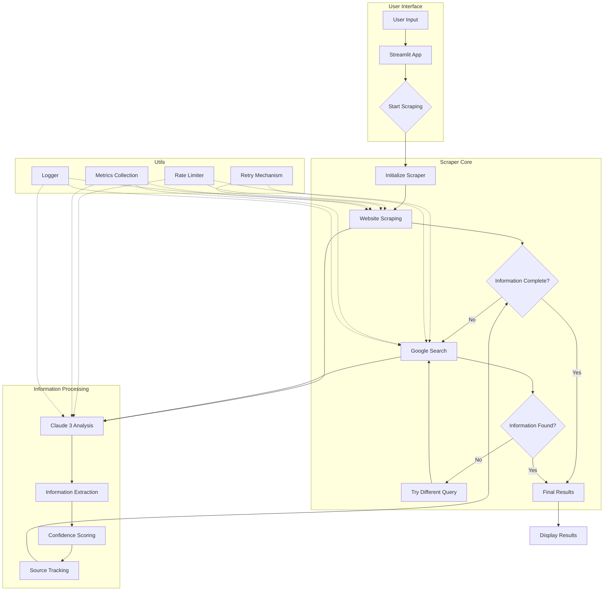

# Company Information Scraper

A web scraping tool built with LangGraph, LangChain, and Streamlit that extracts company information from websites and Google search results.

## Features

- **Website Scraping**: Automatically navigates through company websites to extract information
- **Google Search Fallback**: Falls back to Google search if website scraping fails
- **Smart Navigation**: Uses relevant keywords to find important pages
- **Confidence Scoring**: Provides confidence scores for extracted information
- **Source Tracking**: Lists all sources used for information gathering
- **User-Friendly Interface**: Clean Streamlit interface with progress tracking

## Information Extracted

- Company Name
- Company Location
- Products and Services
- Company Overview
- Target Clients

## Requirements

- Python 3.9+
- Anthropic API Key (for Claude 3)

## Installation

1. Clone the repository:
```bash
git clone <repository-url>
cd webcrawler
```

2. Install dependencies:
```bash
pip install -r requirements.txt
```

3. Create a `.env` file in the project root:
```bash
ANTHROPIC_API_KEY=your_api_key_here
```

## Usage

1. Run the application:
```bash
streamlit run main.py
```

2. Enter company name and website URL in the web interface

3. Click "Search" to start the scraping process

4. View results with confidence scores and sources

## Project Structure

```
webcrawler/
├── main.py                         # Entry point
├── requirements.txt                # Dependencies
└── src/
    ├── ui/
    │   └── streamlit_app.py       # UI implementation
    ├── scraper/
    │   └── langgraph_scraper.py   # Core scraper logic
    └── utils/
        ├── logger.py              # Logging utilities
        ├── rate_limiter.py        # Rate limiting
        ├── metrics.py             # Metrics collection
        └── retry.py               # Retry mechanism
```

## How It Works

1. **Website Scraping**:
   - Starts with the main website
   - Extracts and follows relevant navigation links
   - Tries up to 5 different pages
   - Switches to Google search if unsuccessful

2. **Google Search**:
   - Generates queries based on missing information
   - Searches and scrapes results
   - Tries up to 5 different searches
   - Stops when all information is found or max tries reached

3. **Information Extraction**:
   - Uses Claude 3 to analyze content
   - Extracts structured information
   - Assigns confidence scores
   - Tracks information sources

## Rate Limiting

- Anthropic API: 50 calls/minute
- Google Search: 60 calls/minute
- Web Scraping: 30 calls/minute

## Error Handling

- Automatic retries for transient errors
- Graceful fallback to Google search
- Clear error messages in UI
- Comprehensive logging

## Dependencies

- streamlit: Web interface
- langchain: LLM framework
- langchain-anthropic: Claude 3 integration
- langgraph: Workflow management
- beautifulsoup4: HTML parsing
- requests: HTTP client
- python-dotenv: Environment management
- googlesearch-python: Google search

## Contributing

1. Fork the repository
2. Create a feature branch
3. Commit your changes
4. Push to the branch
5. Create a Pull Request

## License

MIT License

## Execution Flow



## Detailed File Structure

### Core Files
- `main.py`: Entry point of the application. Initializes Streamlit and sets up the environment.
- `requirements.txt`: Lists all project dependencies with specific versions for reproducibility.
- `.env`: Contains environment variables including API keys (not tracked in git).

### Source Code (`src/`)

#### UI Components (`src/ui/`)
- `streamlit_app.py`: Implements the web interface using Streamlit.
  - Handles user input and result display
  - Manages scraping process visualization
  - Implements progress tracking and error display

#### Scraper Components (`src/scraper/`)
- `langgraph_scraper.py`: Core scraping logic implementation.
  - Defines the LangGraph workflow
  - Implements website navigation and content extraction
  - Manages Google search integration
  - Coordinates with Claude 3 for content analysis

#### Models (`src/models/`)
- `scraper_state.py`: Defines the state management for the scraping process.
- `scraper_models.py`: Contains data models for scraped information.
- `company_info.py`: Defines the company information data structure.

#### Utilities (`src/utils/`)
- `rate_limiter.py`: Implements rate limiting for API calls.
  - Manages API quotas
  - Prevents service throttling
  - Implements backoff strategies

- `metrics.py`: Handles metrics collection and monitoring.
  - Tracks success rates
  - Measures response times
  - Monitors resource usage
  - Generates performance reports

- `retry.py`: Implements retry mechanisms for failed operations.
  - Handles transient failures
  - Implements exponential backoff
  - Manages retry policies

- `logger.py`: Provides logging functionality.
  - Implements structured logging
  - Manages log levels
  - Handles log rotation
  - Supports debugging

### Additional Directories
- `logs/`: Contains application logs
- `metrics/`: Stores metrics data
- `tests/`: Contains test files
- `.mypy_cache/`: MyPy type checking cache

## Component Interactions

1. **User Interface Layer**:
   - Streamlit app provides the frontend
   - Handles user input validation
   - Displays real-time progress
   - Shows results with confidence scores

2. **Scraping Layer**:
   - LangGraph manages the scraping workflow
   - Implements intelligent navigation
   - Handles content extraction
   - Manages state transitions

3. **Processing Layer**:
   - Claude 3 analyzes content
   - Extracts structured information
   - Assigns confidence scores
   - Tracks information sources

4. **Utility Layer**:
   - Provides rate limiting
   - Implements retry logic
   - Collects metrics
   - Manages logging